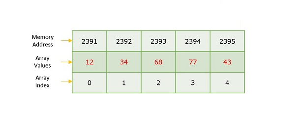
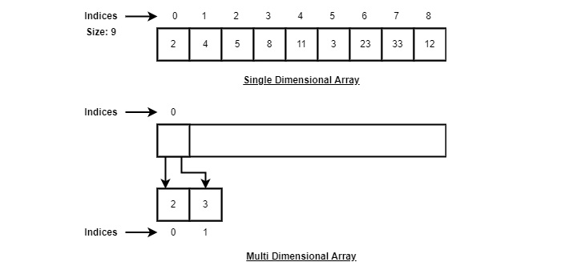

## Arrays Data Structure

### Description

It is a type of linear data structure that is defined as a collection of elements with the same or different data types. 

They exist in both single and multiple dimensions. 

It is a crucial data structure when there is need to store multiple elements of the same nature together at one place. 

```
Array Data Structure Preview
```


The difference between array index and a memory address is that array index acts like a key value to label elements in the array. 

A memory address is the starting address of the free memory available. 

### Need for Arrays

Arrays offer O(1) random access time. This aspect means that accessing the 1st index or 1000th index will both take the same time. 

```
Array Representation

- index starts at 0.
- Array length is 9 meaning it can store 9 elements.
- Each element can be accessed via its index. 
```


## Basic Operations in Arrays

- **Traverse** - print all elements in an array one by one.
- **Insertion** - add an element at a given index.
- **Deletion** - Deletes an element at a given index.
- **Search** - Searches an element using the given index or by the value.
- **Update** - Updates an element at given index. 
- **Display** - Displays the contents of the array. 

#### Insertion

It is an operation that involves adding one or more elements into an array. This is done based on the specified requirements, which means adding data at beginning, end, or any given index of array. **Time Complexity --> O(n)**
The time complexity is linear because there is need to shift index of elements after the values are inserted.

```
Algorithm

1. start
2. Create an array of a desired datatype and size.
3. Initialize a variable 'i' as 0.
4. Enter the element at the ith index of the array.
5. Increment I by 1.
6. Repeat the steps 4 & 5 until the end of the array.
7. Stop. 
```

#### Deletion 

We delete an element from a particular index of an array. The operation takes place as we assign a value in consequent index to current index.

```
Algorithm

1. Start
2. Set J = K
3. Repeat steps 4 and 5 while J < N
4. Set LA[J] = LA[J + 1]
5. Set J = J + 1
6. Set N = N - 1
7. Stop
```
#### Search 

Searching is done using a key. The key elements sequentially compares every value in the array to check if it is present.

```
Algorithm

1. Start
2. Set J = 0
3. Repeat steps 4 and 5 while J < N
4. IF LA[J] is equal ITEM THEN GOTO STEP 6
5. Set J = J +1
6. PRINT J, ITEM
7. Stop
```

#### Traversal

This operation traverse through all the elements in the array. We use loops to conduct the operation.

```
Algorithm

1  Start
2. Initialize an Array of certain size and datatype.
3. Initialize another variable ‘i’ with 0.
4. Print the ith value in the array and increment i.
5. Repeat Step 4 until the end of the array is reached.
6. End
```

#### Update

It refers to the operation where an existing element is updated in a given array.

```
Algorithm

1. Start
2. Set LA[K-1] = ITEM
3. Stop
```

#### Display 

This operation displays all the elements in the entire array using print statement.

```
Algorithm

1. Start
2. Print all the elements in the Array
3. Stop
```