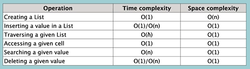

# Python Lists

A list is a data structure that holds an ordered collection of items. List in python is a bulletin data structure that comes inbuilt with Python.

The main difference between array and lists is that lists can contain elements of different data types.

### Access / Traverse Lists

The accessibility or traversal of lists is similar to that of arrays.

### Update / Insert

Again the operations are the same as the one in arrays.
```
myList = [1,2,3,4,5,6,7,8]
print(myList)
--------------------------
myList.insert(4, 15)
myList.append(55)
newList = [8,3,7,12]
myList.extend(newList)
```
Time and space complexity of the operations is O(n)

### Deletion Operation

we can delete elements in a list using the slice operator.

```
myList = ['a', 'b', 'c', 'd', 'e']
print(myList[0:2])
```
In the above sample code the first two elements in `index(0)` and `index(1)` are printed the other elements are eliminated.

#### Deletion Inbuilt Method

```
Delete from a specific index using the pop() Method
myList = ['a', 'b', 'c', 'd', 'e']
myList.pop(1)
The above method deletes the element/value at the index one.
delete() method
myList = ['a', 'b', 'c', 'd', 'e']
del myList[0:2]
`The method above deletes elements in the range`
remove() method
```
 Time Complexity for delete operation is O(n)

 #### Search Operation

 The search operation in lists is conducted using the _`IN operator`_ and _`Linear Search`_

 ```
 myList = [10, 30, 90, 70, 20]

 if 20 in myList:
    print(myList.index(20))
 else:
    print('The  value does not exist in the list')
 ```

 Time Complexity for search operation is O(n)

 ## Common Pitfalls of Lists

 - Because of the many ways of doing the same thing we can mix the operations of the methods.
 - Some methods can completely alter original list unexpectedly i.e. `sort` and `sorted` method could alter original lists. Visit `https://docs.python.org/` for any clarification on inbuilt methods and their effects.

 # Similarities of Lists and Arrays
 1. Both data structures are mutable.
 2. Both can be indexed and iterated through.
 3. They can both be sliced.

 # Difference of Lists and Arrays
 1. Arrays are very effective for arithmetic operations.
 2. You have to specify data type of elements in an array.
 3. All elements in an array have to be of the same type.

 # Time and Space Complexities of Lists

 